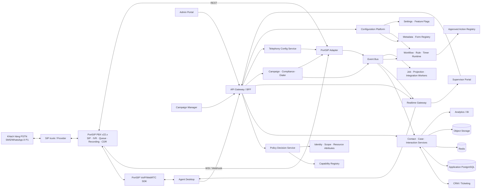

# Kiến trúc tích hợp PortSIP

## 1. Nguyên tắc

1. PortSIP là telephony system of record; Portsip CC không tự triển khai SIP/media/ACD.
2. Mọi API/vendor detail nằm sau `PortSIP Adapter` và frontend `SDK Wrapper`.
3. Browser không giữ PortSIP admin token và không gọi admin REST API trực tiếp.
4. Consumer được thiết kế phòng thủ như at-least-once/unordered: chấp nhận duplicate/out-of-order/loss và xử lý idempotent; đây không phải cam kết delivery của vendor.
5. CDR là bản ghi hoàn tất có tính authoritative; real-time event tối ưu trải nghiệm nhưng phải reconcile.
6. Correlation key PortSIP phải lưu nguyên: `session_id`, `call_id`, `cdr_id`, extension và timestamps. `portsip_tenant_id` chỉ được dùng sau khi ánh xạ sang `app_tenant_id`; tenant scope không thay cho call correlation.
7. Source of truth và quyền ghi được định nghĩa cho từng entity; không truy cập database nội bộ PortSIP.
8. Mọi module giao tiếp qua typed command/query ports hoặc versioned events; không đọc/ghi trực tiếp bảng thuộc module khác.
9. Authorization là deny-by-default và được thực thi ở server cho API, query, object lookup, realtime, export, file/recording, worker và PortSIP command; ẩn menu không phải kiểm soát bảo mật.
10. Feature flag/entitlement chỉ quyết định code path có khả dụng, không cấp quyền. Một capability chỉ được phép khi đồng thời khớp data scope, relationship/attribute condition và không có hard/explicit deny.
11. Custom field, form/layout, business workflow và setting được mở rộng bằng metadata có version; không chạy arbitrary JavaScript, SQL, shell, URL hoặc remote component do operator nhập.
12. Registration, call/session, dial-attempt, tenant isolation, consent/DNC hard-stop, secret handling và carrier guardrail là code-owned invariants; workflow động không được ghi đè.
13. P0 là extensibility kernel và bounded self-service theo [blueprint mở rộng](08-KIEN-TRUC-MO-RONG-PHAN-QUYEN-CAU-HINH-DONG.md), không phải nền tảng low-code/BPMN tổng quát.

## 2. Sơ đồ bối cảnh

Trong MVP có thể triển khai các logical service trong một modular monolith để giảm chi phí vận hành. Ranh giới module và event contract vẫn được giữ để tách service khi tải hoặc ownership yêu cầu.

## 3. Ba bề mặt tích hợp PortSIP

### 3.1 SDK trong Agent Desktop

Trách nhiệm:

- SIP registration và browser media.
- Audio device lifecycle và permission.
- Call state/call control: answer, reject, hangup, mute, hold, resume, DTMF, transfer và conference nếu được chốt.
- Expose network/media statistics nếu SDK cung cấp.

SDK được bọc bởi một interface nội bộ, ví dụ `TelephonyClient`, để UI không phụ thuộc trực tiếp tên method/event vendor. Wrapper duy trì finite-state machine và chỉ cho phép command hợp lệ theo state.

### 3.2 REST API ở backend

Trách nhiệm:

- Login/token refresh qua HTTPS và service credential có scope tối thiểu.
- Provision/read metadata của users, queues, skills, memberships và recording/CDR khi cần.
- Quản lý provider/trunk, DID-associated inbound rules và outbound rules trong scope P0 đã phê duyệt.
- Agent state/call administration chỉ qua endpoint được xác minh trên exact PBX build.
- Tạo/điều khiển outbound session qua topology được PoC chọn; mọi command có idempotency/reconciliation ở app layer.
- Reconciliation snapshot khi realtime stream bị gián đoạn.

PortSIP REST API v22 dùng Bearer token, JSON và base path `/api/`. Tại ngày khảo sát, PBX hiện hành là v22.6.3 nhưng REST reference công khai mới nhất là v22.3; không được code theo v22.0/v16 cũ hoặc giả định backward compatibility. Client phải lấy contract đúng instance, có timeout, retry chỉ với operation an toàn/idempotent, circuit breaker, rate-limit control và correlation ID.

### 3.3 WSI/WebSocket và Webhook ở backend

Trách nhiệm:

- Subscribe extension, queue, CDR và trunk events theo quyền.
- Nhận CDR/extension callback từ webhook khi cấu hình.
- Chuẩn hóa raw payload thành internal event versioned schema.
- Lưu inbox trước khi xử lý; deduplicate; publish ra event bus; retry/DLQ.

WSI gateway phải tự reconnect, re-authenticate, resubscribe và chạy REST reconciliation sau gap. Public WSI/REST contract hiện dừng ở v22.3 trong khi PBX ứng viên là v22.6.3, nên PoC phải capture payload thực tế và coi schema/behavior là contract gate. Do delivery/retry semantics công khai chưa nhất quán, receiver phải được thiết kế phòng thủ như at-least-once/unordered: trả thành công nhanh sau durable write rồi xử lý bất đồng bộ.

## 4. Logical components

| Thành phần | Trách nhiệm |
|---|---|
| Web App | Agent, Supervisor, Campaign Manager và Admin UI; không chứa business secret |
| Telephony SDK Wrapper | Cô lập SDK, call FSM, device management và client telemetry |
| BFF/API Gateway | Session, authorization, response shaping, rate limit và anti-CSRF |
| Identity, Organization & Scope | OIDC/SSO, user/service identity, tenant → business-unit → team tree, resource relationships và extension mapping |
| Capability Registry & Policy Service | Capability catalog, scoped role bindings, RBAC + relationship/attribute conditions, PDP/PIP contract, obligations và policy cache/invalidation |
| PortSIP Adapter | REST token/client, WSI subscriber, webhook receiver và reconciliation |
| Interaction Service | Interaction/call legs/timeline, disposition, note và recording reference |
| Contact/Case Service | Customer profile, dedup, case/ticket, follow-up và CRM sync |
| Campaign Service | Campaign lifecycle, list/version, assignment, script/policy và immutable publish snapshot |
| Compliance/Suppression | Consent provenance/expiry, DNC/suppression, timezone/quiet-hours và final pre-dial check |
| Dialer Orchestrator | Preview/progressive 1:1, agent/contact reservation, pacing, retry/callback và emergency stop |
| Telephony Config Service | Draft/diff/approval/apply/read-back/test/rollback cho trunk, DID và rules; immutable vault secret-version references |
| Configuration Registry | Typed setting definitions, scope/precedence, effective-value resolution, version/approval/audit và feature-flag adapter |
| Metadata & Form Runtime | Versioned custom fields, option sets, form/layout definitions, server-side validation và permission-filtered manifest |
| Workflow, Rule, Approval & Timer Runtime | Business state/transition, declarative guard, approved action, durable SLA/timer, simulation, version pinning và migration |
| Extension Registry | Đăng ký typed ports/adapters, logic packs, actions, projections, UI slots, compatibility và conformance tests |
| Realtime Gateway | Fan-out event đã lọc theo tenant/business-unit/team/queue/campaign/own scope qua WebSocket/SSE; re-authorize subscription và revoke |
| Reporting Projection | KPI projections, data dictionary và policy-scoped export/scheduled report |
| Integration Worker | CRM/IdP/message providers; service identity + delegated scope, idempotency, retry, circuit breaker và DLQ |
| Audit Service | Immutable record của auth, data access, monitoring, export và config change |

### 4.1 Module ownership, contracts và registries

- Mỗi module sở hữu schema, migration, command/query handlers, capability/config definitions, events, health checks, metrics và runbook của mình. Module khác không truy cập table nội bộ.
- Giao tiếp đồng bộ qua typed application port; giao tiếp bất đồng bộ qua canonical event envelope có `event_id`, `event_type`, `event_version`, `occurred_at`, `producer`, `app_tenant_id`, `aggregate_type/id/version`, optional `initiating_subject_id`, optional `executing_service_id`, `correlation_id`, `causation_id`, `trace_id` và `data`; chi tiết ở tài liệu 11.
- Transaction không đi xuyên module. Dùng local transaction + outbox, idempotency key và saga/compensating action; consumer ignore additive field chưa biết, còn breaking change cần event/API version mới và deprecation window.
- Shared kernel chỉ chứa primitive ổn định như ID, time, E.164, event envelope và authorization context; không đặt domain rule vào `common/utils` hoặc một rules table dùng chung cho mọi domain.
- PortSIP, CRM, IdP, carrier và notification provider đều sau adapter; domain model không import vendor DTO/SDK. Adapter mới phải qua contract/conformance tests.
- `Capability Registry`, `Configuration Registry`, `Metadata/Form Registry`, `Approved Action Registry` và `Extension Registry` là catalog có owner/version; key đã deprecate không được tái sử dụng.
- Các extension point P0 gồm CRM adapter, dial strategy, eligibility validator, assignment strategy, workflow action, import mapper, notification adapter, report projection và approved UI slot. Logic pack là declarative metadata hoặc compiled module được deploy qua CI; operator không upload executable code.
- MVP giữ các module trong modular monolith. Chỉ tách service khi có evidence về scale, blast radius, privileged secret boundary, data residency hoặc team/release ownership; public contract không đổi khi tách.

### 4.2 Authorization: bốn lớp quyền và scope graph

Một quyết định thống nhất có dạng `can(subject, capability, resource, action_context) → allow/deny + reason_code + obligations`. Deny-by-default; hard security/compliance invariant và explicit deny thắng allow. Role là template capability, không tự mang data scope.

| Lớp | Câu hỏi | Enforcement bắt buộc |
|---|---|---|
| Data scope | Subject được thấy record nào? | Query filter, object lookup, search/count/facet, report, realtime và export |
| Quyền tính năng/capability | Được thực hiện nghiệp vụ gì? | API/BFF, application command và background handler; feature flag không cấp quyền |
| Screen/navigation | Được thấy route/menu/widget nào? | Backend tạo UI manifest để hỗ trợ UX; deep link và API vẫn qua server policy |
| Field/action | Field nào hide/mask/read/edit/export và action nào được chạy? | Server response shaping, write validation, file/recording gateway và command guard |

Scope tổ chức là cây `tenant → business_unit → team`. `queue` và `campaign` là resource liên kết rõ với một hay nhiều business unit/team; chúng không mặc định là con của nhau. `own/assigned` là predicate trên `owner`, `created_by`, `assigned_to` hoặc `participant`, không phải node trong cây. Grant có `subject + capability_set + scope_type + scope_id + include_descendants + conditions + valid_from/to`; client không được tự khai tenant/role/scope rồi yêu cầu server tin tưởng.

Decision được phép khi đồng thời: feature/entitlement khả dụng, capability được grant, resource khớp relationship/own scope, ABAC condition như environment/resource state/authentication strength đạt và không có deny. Ví dụ capability ổn định gồm `interaction.note.edit`, `contact.phone.unmask`, `campaign.publish`, `recording.play`, `recording.download`, `report.export`, `trunk.change.approve` và `trunk.change.apply`.

- **PAP** quản lý role template, scoped grant, data classification/field policy, separation-of-duties, access review và break-glass.
- **PDP** trả allow/deny, reason, matched scope, policy version và obligations như `mask:phone_last4`, `read_only`, `require_step_up` hoặc `require_approval`.
- **PIP** cung cấp IdP group/auth strength, organization/resource relationships, ownership/assignment, resource state, environment và data classification.
- **PEP** nằm tại BFF, query repository, object lookup, serializer, WebSocket/SSE, report/export, recording/file proxy, workflow/worker và PortSIP Adapter.

Policy cache có key `tenant + subject + policy_version`, TTL bounded và invalidation event khi role, membership, relationship hoặc policy đổi. PDP/PIP lỗi thì thao tác nhạy cảm fail closed; call control thiết yếu chỉ dùng emergency/degraded policy ngắn hạn đã threat-model, không dùng cached allow vô hạn. PostgreSQL RLS có thể bảo vệ tenant boundary như defense-in-depth; scope chi tiết vẫn được áp ở query/repository bằng authorized filter, không query rộng rồi lọc trong memory.

Field classification tối thiểu là `Public`, `Internal`, `Confidential`, `Restricted`; action tách `view`, `view_masked`, `edit`, `search`, `export`, `print`, `download`, `listen`. Search count/autocomplete/dashboard không được tiết lộ resource ngoài scope. Recording playback đi qua proxy/URL ngắn hạn; quyền `play` khác `download`.

Export là capability riêng: job re-authorize cả lúc execute lẫn download, áp lại row/field policy, row cap, approval/reason nếu nhạy cảm, file encryption/TTL/watermark và audit. Worker chạy bằng service identity + tenant/delegated scope, không chạy như super-admin. Realtime topic được server bind từ effective scope và phải re-authorize khi subscribe, reconnect hoặc policy invalidation; browser không subscribe arbitrary queue/campaign ID.

Maker không được approve/publish/execute change của chính mình khi separation-of-duties bật. Break-glass yêu cầu step-up authentication, reason/ticket, grant có TTL, alert tức thời và hậu kiểm; Platform Admin không mặc định được xem unmasked PII hoặc recording.

### 4.3 Configuration, metadata/form và business workflow runtime

`Configuration Registry` chỉ chứa typed key do module owner đăng ký qua code/migration. Mỗi definition có owner/version, type/default/options, validation/dependencies, allowed scopes và precedence, read/write/approve capabilities, classification/secret, risk/approval policy, activation mode, UI control/help/example và impact tags. Baseline resolution là `platform default < environment < tenant < domain resource < user`, nhưng mỗi key phải khai evaluator riêng; ambiguous team/queue/campaign match là validation error. User override chỉ dùng cho setting an toàn như audio/UI, không vượt compliance, retention, caller ID hoặc security policy.

UI luôn hiển thị effective value, resolution chain, override, actor/time/version, impact và `immediate/scheduled/new-instance-only/restart-required`; dùng `Reset to inherited`. Lifecycle thống nhất là `draft → validated → simulated/previewed → pending_approval → scheduled/published → effective → superseded/rolled_back`, có nhánh `failed/drifted`. Publish tạo immutable version; secret chỉ lưu vault reference; concurrent edit dùng ETag/optimistic concurrency.

Custom fields P0 chỉ áp dụng cho app-owned `contact read-model`, `case`, `interaction`, `campaign_member` và `disposition form`, không chèn vào PortSIP-owned CDR/trunk/session schema. Core identity, tenant, state, timestamps, telephony correlation và compliance invariants vẫn là typed columns; custom values dùng JSONB/document + pinned `schema_version`, field cần search/report có typed index/projection. Không dùng EAV thuần.

Field definition có stable key, entity/type, label/help/i18n, default/required/read-only, validation/options, classification/retention, search/filter/sort/index và permission. Form definition tách data schema, gồm page/tab/section/group/order/column, approved widget và binding theo persona/queue/campaign/case type/workflow state. Conditional visibility/required/read-only dùng safe declarative expression; backend đánh giá lại khi submit. Không arbitrary HTML/CSS/component URL. Breaking type change cần schema version mới, dry-run/backfill/migration; delete là deprecate/hide trước, không làm mất dữ liệu lịch sử.

Business workflow version gồm states/transitions, capability, typed guards, form/required fields, approved actions, approval quorum/maker-checker, SLA/timers/escalation, retry/timeout/idempotency/compensation và compatibility metadata. Expression chỉ truy cập allowlisted facts/functions với CPU/time/size limit; action chỉ từ registry như assign, update field, create task, notify, request approval, pause campaign hoặc gọi approved connector.

Instance mới pin published workflow/schema version; instance đang chạy giữ version cũ. Migration in-flight cần explicit state/field mapping, dry-run, impact report, approval và rollback. Timer/job lưu durable state, lease/idempotency key, business calendar/timezone/DST, retry/backoff và DLQ; restart/failover không mất timer hoặc tạo hai logical outcomes. Action có kết quả không rõ không retry mù mà vào `reconcile_pending`/manual task.

### 4.4 Enforcement flow và Operator UX

1. BFF lấy subject/session từ OIDC, không lấy role/scope từ payload; PIP resolve relationships/resource attributes.
2. PDP quyết định capability + scope + conditions và trả field/action obligations.
3. Query PEP áp authorized scope trước khi tính list/search/count/facet; object PEP chống IDOR; serializer loại/mask field trước browser.
4. UI nhận screen/form/settings manifest đã lọc để tạo menu, form và action dễ hiểu, nhưng server vẫn re-authorize khi submit.
5. Command handler re-authorize resource state, step-up/approval và domain invariant ngay trước side effect; PortSIP Adapter kiểm tra lại delegated scope trước privileged request.
6. Realtime/export/worker giữ tenant, subject/service identity, policy/config/workflow version và correlation ID; policy change phát invalidate/revoke.
7. Audit ghi actor/service/delegated actor, tenant, action, resource, matched scope, allow/deny reason, policy version, obligations và request/correlation ID; không ghi secret/raw PII.

Admin Center dùng cùng mental model `Choose template → Edit draft → Validate → Preview effective value/diff → Simulate/Test → Approve → Schedule/Publish → Monitor → Roll back`. Basic mode đi trước Advanced; có inline validation, dependency/impact panel, autosave draft, concurrent-edit warning, preview theo role/scope, permission-denied/degraded/drift/partial-failure state và safe next action. Màn hình cấu hình đáp ứng WCAG 2.1 AA; published change luôn qua version mới/rollback thay vì hứa atomic undo.

### 4.5 MVP admin write boundary

- Tenant-owned provider/trunk type và DID-pool assignment được exact PortSIP role/API cho phép, cùng tenant-scope inbound/outbound rules: Portsip CC được ghi qua backend sau validate/approval; PortSIP vẫn là source of truth và phải read-back sau apply.
- System/shared/IP-based trunk object và DID-pool assignment cần PortSIP System Admin nên mặc định read-only/deep-link. Tenant-scope rule vẫn có thể tham chiếu một trunk/DID pool đã được System Admin gán nếu exact role/API cho phép. Chỉ mở write vào chính system/shared trunk sau risk approval với dedicated service principal, tách deployment boundary và audit riêng.
- Queue, skill, membership, IVR, recording policy và monitor group: PortSIP Portal tiếp tục là nơi thay đổi; Portsip CC chỉ sync read-only, mapping, drift warning hoặc deep-link.
- Global SIP transports/listening ports, SBC, firewall, certificates và raw advanced-routing text không thuộc tenant-admin P0; chỉ System Admin/vendor portal sau exact-version PoC.
- Ngoài config scope nêu trên, Portsip CC chỉ ghi sang PortSIP cho agent tự đổi state và call/monitor action đã được exact-version PoC + RBAC phê duyệt.
- Force state/logout và bulk PBX configuration là P1, không thuộc P0.
- Disposition, reason mapping của ứng dụng, required fields, feature flags và CRM workflow do Portsip CC sở hữu.

## 5. Data ownership và mô hình chính

| Entity | Source of truth | Ghi chú |
|---|---|---|
| Tenant/extension/queue/skill/telephony role | PortSIP | App lưu mapping/cache có version và drift detection |
| Live call/agent/queue state | PortSIP event stream | Cache/projection; CDR reconcile sau call |
| CDR/recording metadata | PortSIP | App lưu reference và access policy, không nhân bản mặc định |
| User identity, organization, role/grant và resource relationships | IdP + Portsip CC | IdP là identity/group input; app sở hữu business-unit/team tree, scoped grants, queue/campaign relationships và mapping tới PortSIP user/extension |
| Contact/account | CRM được chọn ở D-004 | App lưu mapping/cache/read model; có external ID và conflict policy |
| Case/ticket | CRM được chọn ở D-004 | App không trở thành master ngầm khi CRM gián đoạn; local draft được sync/reconcile |
| Interaction, note, disposition, follow-up task | Portsip CC | Liên kết PortSIP session/call IDs; khác với queue callback |
| Queue callback | PortSIP | App chỉ lưu `queue_callback_reference` và trạng thái phục vụ timeline/report |
| Trunk/provider, inbound/outbound rules | PortSIP | App lưu desired-state draft, immutable vault secret-version reference, snapshot không plaintext, approval/test/audit; read-back PortSIP quyết định effective state |
| Campaign, list version, consent/DNC/suppression, pacing/retry policy | Portsip CC | Policy snapshot bất biến theo campaign publication; regulatory DNC không dựa duy nhất vào PBX blacklist |
| Outbound attempt/reservation/callback | Portsip CC + PortSIP session/CDR | App sở hữu logical attempt; PBX sở hữu call execution; tương quan bằng opaque attempt ID + session/call IDs |
| Report projection | Portsip CC/PortSIP Data Flow | Voice metric có thể reuse; cross-channel cần app projection |
| Capability/policy/config/metadata/form/workflow definitions | Portsip CC | Published version bất biến; operator chỉ dùng definition/action/extension đã đăng ký |
| Workflow instance, approval và timer | Portsip CC | Pin definition version; durable, idempotent, có transition/execution audit và explicit migration |

Các bảng/aggregate tối thiểu:

- `tenant`, `business_unit`, `team`, `organization_closure`, `app_user`, `portsip_identity`
- `resource_relationship`, `role_template`, `capability`, `role_capability`, `role_binding`, `policy`, `policy_version`, `policy_test_case`
- `queue_mapping`, `skill_mapping`, `agent_queue_mapping`
- `contact`, `contact_endpoint`, `case`, `case_participant`
- `interaction`, `interaction_leg`, `interaction_event`, `disposition`, `note`, `follow_up_task`, `queue_callback_reference`
- `campaign`, `campaign_version`, `campaign_list`, `campaign_member`, `consent_record`, `suppression_entry`, `dial_policy`
- `agent_reservation`, `dial_attempt`, `dial_attempt_event`, `scheduled_callback`, `caller_id_profile`
- `telephony_config_change`, `telephony_config_snapshot`, `trunk_mapping`, `did_inventory`, `routing_rule_mapping`
- `config_definition`, `config_value`, `config_version`, `feature_flag_binding`
- `custom_field_definition`, `schema_version`, `form_definition`, `form_version`, `option_set`
- `workflow_definition`, `workflow_version`, `workflow_instance`, `workflow_transition_log`, `rule_set`, `rule_version`
- `approval_request`, `approval_step`, `timer_job`, `business_calendar`, `extension_manifest`
- `recording_reference`, `event_inbox`, `event_outbox`, `audit_log`

Mọi bảng tenant-owned có `app_tenant_id` bắt buộc; bảng `portsip_tenant_mapping(app_tenant_id, portsip_tenant_id, environment)` là unique theo environment. Organization closure và resource relationship phải giữ cùng tenant, có database constraint chống cross-tenant edge. Raw event được scope bằng connection/service credential và `portsip_tenant_id`; event không ánh xạ được phải vào DLQ thay vì rơi vào tenant mặc định. External identifiers có unique constraint theo tenant/source. PII được phân loại để áp retention, row/field masking và access audit.

Capability, config, field, form, workflow và extension key là stable identifier, không tái sử dụng sau deprecation. Record có custom data phải pin schema version; workflow instance pin workflow version; background execution lưu policy/config/workflow version cùng input hash để replay và điều tra quyết định. Published definitions là append-only; migration/backfill dùng run ID, dry-run và idempotency để không phát side effect hai lần.

## 6. Luồng cuộc gọi inbound chuẩn

1. PSTN gọi DID; trunk chuyển vào PortSIP.
2. PortSIP áp office-hours/IVR/queue/routing và phát events.
3. PortSIP Adapter nhận event, persist raw inbox và phát `interaction.started`/`queue.entered`.
4. Interaction Service upsert interaction bằng correlation keys; Contact Service chuẩn hóa số và tìm contact.
5. Realtime Gateway resolve assigned/own relationship, re-authorize subscription và chỉ gửi screen-pop/field manifest đã lọc cho đúng agent, tenant và interaction; không fan-out tenant-wide rồi lọc ở browser.
6. Agent nhận cuộc gọi qua SDK; SDK wrapper cập nhật local call state, backend event cập nhật global state.
7. Agent thao tác note/case/disposition qua form version đã pin; backend re-authorize field/action, validate schema/transition và autosave độc lập với call signaling.
8. Khi call kết thúc, PortSIP gửi event/CDR; backend finalize call legs và ACW.
9. Recording vẫn nằm tại PortSIP ở MVP; app liên kết metadata/reference sau khi sẵn sàng và chỉ cấp playback/download bằng capability riêng qua backend authorization/audit. Report projection và aggregate áp cùng authorized scope, cập nhật idempotent.
10. Reconciliation job phát hiện interaction chưa có CDR/recording quá ngưỡng và đưa vào repair/DLQ.

## 7. Luồng outbound preview/progressive 1:1

1. Eligibility worker dùng service identity + tenant/campaign delegated scope, pin policy/rule version, chọn campaign member và lọc consent/DNC/suppression, timezone/quiet-hours, retry/max-attempt và caller-ID policy.
2. Ngay trước dispatch, Compliance Service kiểm tra lại policy hiện hành; dữ liệu thiếu hoặc dependency stale thì fail closed.
3. Trong một transaction, Dialer Orchestrator reserve contact + một agent `Ready`, tạo `dial_attempt` và ghi outbox/idempotency key.
4. Preview chờ agent bấm `Dial`; progressive 1:1 chỉ phát lệnh khi reservation còn hợp lệ. Browser không chạy scheduler hoặc tự tăng dial ratio.
5. PoC chọn một trong hai cơ chế gọi: SDK agent-originated hoặc authenticated Call Control API. Không dùng endpoint nhận extension password từ browser.
6. Adapter gắn opaque `attempt_id` vào trường correlation/vendor metadata đã được contract-test; không đưa PII hoặc policy secret vào đó.
7. WSI/webhook/CDR cập nhật session/call legs. Timeout không rõ kết quả chuyển `reconcile_pending`; worker tra cứu trước khi phát lệnh khác.
8. Agent hoàn tất disposition/right-party/conversion/callback trên form/workflow version đã pin; retry engine gọi approved logic pack và tính next eligible time theo immutable policy version.
9. Pacing chặn theo provider/trunk/tenant/campaign CPS và concurrency. Inbound protection dừng cấp attempt mới khi threshold bị vi phạm; active call được hoàn tất.
10. Reporting phân biệt `eligible`, `attempted`, `PBX accepted`, `SIP answered`, `right-party contact`, `conversion` và `dialer abandonment`; query/export re-authorize tenant/business-unit/team/campaign scope và field obligations.

## 8. Luồng cấu hình SIP trunk/DID/routing

1. Telephony Admin có capability/scope phù hợp tạo draft từ current PortSIP snapshot và pinned config-definition version; secret cũ chỉ hiển thị trạng thái `configured`, không bao giờ trả plaintext. Snapshot chỉ giữ immutable vault secret-version reference còn trong approved rollback window.
2. Backend re-authorize field/action rồi validate typed setting schema, hostname/port/auth mode/DID format, duplicate/range, prefix/number-length overlap, group/resource relationship scope, caller-ID allowlist và protected/emergency route.
3. UI hiển thị effective-value resolution chain, semantic diff và impact: đối tượng bị ảnh hưởng, route precedence, số/DID xung đột, credential/transport thay đổi, approval policy và rollback target.
4. Preflight kiểm tra tenant/system ownership, active calls, campaign/rule dependencies, alternate route và capacity; production yêu cầu step-up auth và approver khác actor khi policy dual-control bật.
5. Pause dispatch liên quan và drain active calls trước update/disable/delete; Adapter apply provider/rule mới ở trạng thái disabled khi endpoint cho phép, rồi GET/read-back và so với desired state.
6. Chạy registration/status check nếu contract hỗ trợ và synthetic inbound/outbound test call; không tuyên bố “connected” chỉ vì POST trả 2xx.
7. Chỉ activate sau test pass và PDP xác nhận lại quyền execute; lưu actor/service/approver/reason, matched scope, policy/config version, before/after, PortSIP resource IDs, response hash và test evidence.
8. Nếu mismatch/failure, giữ disabled, cảnh báo drift và rollback bằng compensating actions. Credential chỉ tự rollback khi vault version còn retention và carrier vẫn chấp nhận; nếu không phải manual/vendor-assisted recovery. Delete hard chỉ dùng sau drain, dependency migration và explicit confirmation.

PortSIP REST v22.3 công khai nhóm `Trunks`, `Inbound Rules` và `Outbound rules`. Tuy nhiên PBX ứng viên v22.6.3 mới hơn reference, và inbound/outbound rule yêu cầu capability rộng `PhoneSystem.FullAccess`; vì vậy mọi field, permission, secret-return behavior và rollback semantics là Day-10 contract gate, không phải giả định implementation.

## 9. State machines và failure handling

Không dùng một FSM duy nhất. Các state machine độc lập nhưng liên kết bằng agent/interaction/config IDs:

- Registration/device FSM: `uninitialized → initializing → registering → registered ↔ reconnecting → unregistered/error`.
- Agent availability FSM: PortSIP states `Logged Out`, `Not Ready + reason`, `Ready`, `Queue Call`, `Other Call`, `Wrap Up`. App không tự suy ra Ready từ registration.
- Call/session FSM theo từng `session_id`: `offered/ringing → connecting → active ↔ held → ended/failed`, với consult/transfer/conference được mô hình hóa thành nhiều `interaction_leg` có parent/relationship thay vì một state tuyến tính.
- Campaign FSM: `draft → published/scheduled → active ↔ paused → completed/stopped`; published policy/list version không sửa tại chỗ.
- Dial attempt FSM: `eligible → reserved → dispatch_pending → pbx_accepted/ringing → answered/failed → wrap_up → finalized`, có nhánh `reconcile_pending`, `suppressed` và `cancelled`.
- Config change FSM: `draft → validated → pending_approval → applying → read_back → testing → active`, có nhánh `rejected`, `failed`, `drifted` và `rolled_back`.
- Metadata/config publication FSM: `draft → validated → simulated/previewed → pending_approval → scheduled/published → effective → superseded/rolled_back`, có nhánh `failed/drifted`; published version không sửa tại chỗ.
- Business workflow instance dùng state/transition theo pinned `workflow_version`; chỉ transition đã khai capability, guard, required fields và approved action mới chạy. Đây không thay thế các FSM thoại/dialer code-owned ở trên.

MVP mặc định một ACD call active trên mỗi agent; call waiting/multiple sessions phải có explicit policy và test nếu được bật.

Nguyên tắc:

- Mỗi command có `client_command_id` để chống double click/retry.
- UI không suy diễn global state chỉ từ callback SDK; đối chiếu server event khi có.
- Event cũ hoặc transition không hợp lệ theo từng FSM được lưu raw và cảnh báo, không âm thầm ghi đè terminal state.
- Refresh tab trong active call phải có chính sách rõ: recover nếu SDK hỗ trợ hoặc cảnh báo/chặn.
- WSI mất kết nối: hiển thị degraded banner, reconnect với backoff+jitter, resubscribe và reconcile.
- CRM lỗi: cuộc gọi tiếp tục; dùng cached/basic contact, local draft và sync sau.
- Backend lỗi: media session không nên bị cắt chỉ vì API business gián đoạn; chức năng ghi chép chuyển degraded mode.
- WSI/trunk health stale hoặc inbound protection active: không cấp reservation mới; pause reason hiển thị rõ và resume dùng hysteresis.
- Worker chết sau khi dispatch: lease hết hạn không đồng nghĩa được gọi lại; attempt phải reconcile theo idempotency/correlation trước.
- Worker/timer chết hoặc lease chuyển node: durable job chỉ tạo một logical effect qua idempotency key; action không idempotent có kết quả không rõ phải vào `reconcile_pending`/manual task.
- Policy/config/schema/workflow đổi: publish version mới và phát cache invalidation; in-flight instance giữ version cũ trừ khi migration mapping đã dry-run/approve.
- PDP/PIP lỗi: admin/export/workflow side effect fail closed; không mở quyền bằng fallback role. Revoke role/scope phải đóng hoặc thu hẹp realtime subscription trong bounded window được PoC xác nhận.

## 10. Deployment baseline

### PortSIP plane

- PBX v22.6.3 + SBC v11.2.8 là baseline khảo sát; production pin exact build sau compatibility test và tách khỏi application plane.
- Domain và trusted certificate cho HTTPS/TLS/WSS/WebRTC.
- SIP/media/firewall plan theo tài liệu exact version và topology; không mở port rộng hơn cần thiết.
- IM/Data Flow/cluster chỉ bật khi scope và capacity yêu cầu; Data Flow cần cho reporting hiện đại từ v22.3 và phải được sizing/triển khai theo topology vendor thay vì đặt tùy tiện chung node.
- Recording storage/retention/backup do PortSIP plane sở hữu ở MVP. App chỉ lưu reference; archive/legal-hold copy sang object storage là P1 trừ khi Compliance bắt buộc ở go-live.

### Application plane

- Containerized app trên Dev/UAT/Prod tách biệt.
- Load balancer/WAF, ít nhất hai app instances ở production.
- Managed PostgreSQL HA, Redis HA và object storage versioning/lifecycle cho attachment/report export; không mặc định sao chép recording vào đây ở MVP.
- Event bus có durable delivery; có thể dùng PostgreSQL outbox + worker ở MVP rồi nâng lên broker khi tải yêu cầu.
- Policy/config/metadata/workflow registry dùng PostgreSQL durable store và cache có version/invalidation; không lưu policy hoặc form definition chỉ trong browser/local file.
- Secret manager/KMS; không để secret trong source hoặc CI logs.
- IaC, immutable build artifact, migration forward-compatible và rollback/runbook.
- Config/schema/workflow package được promote `Dev/Sandbox → UAT → Prod` bằng immutable version/checksum; environment-specific secret chỉ là vault reference, không copy plaintext giữa môi trường.
- Sandbox dùng synthetic/anonymized data và connector stub; network policy chặn real dial/send, production PortSIP/CRM endpoint và production secret.

## 11. Observability

### Golden signals

- REST latency/error/rate-limit và token refresh failures.
- WSI connection, reconnect count, last event time và event lag.
- Webhook auth/error, duplicate rate, processing lag và DLQ depth.
- Interaction thiếu CDR/recording, projection mismatch và reconciliation repairs.
- Agent registration, command result, device permission và frontend crash.
- Queue depth, longest wait, SLA breach, agent states và trunk health.
- Campaign eligible/suppressed/backlog, dispatch latency, reservation age, attempt state, retry/callback lag và policy rejection reasons.
- CPS/concurrency theo provider/trunk/tenant/campaign, inbound-protection state, duplicate/orphan/reconcile-pending attempt và config drift/read-back/test failures.
- PDP decision latency/error/fail-closed count, policy cache hit/age/invalidation lag, denied/high-risk decisions và break-glass lifecycle.
- Scope-filter mismatch, realtime revoke lag, unauthorized object probes, export row/field counts và expired download attempts.
- Config/schema/form/workflow publish, simulation failure, ambiguous precedence, migration/backfill progress, timer lag/duplicate prevention, action retry/DLQ và logic-pack health/version.
- Nếu SDK hỗ trợ: RTT, jitter, packet loss, codec và MOS/quality proxy.

Trace/correlation phải đi xuyên `request_id`, `app_tenant_id`, `portsip_tenant_id`, `interaction_id`, `session_id` và `call_id`; background execution thêm service/delegated subject, policy/config/schema/workflow version và input hash. Log/audit không được chứa password/token hoặc raw PII ngoài policy.

## 12. Test strategy

- Unit: call FSM, E.164 normalization, KPI formulas, scoped policy decisions, scope graph, field obligations, config precedence, schema/form validation, workflow guards, timers và idempotency.
- Contract: exact PortSIP REST responses/errors, WSI/webhook payloads, typed module ports, API/event version compatibility, registry/logic-pack conformance và approved action input/output.
- Integration: PBX sandbox + trunk + browser SDK + CRM mock/sandbox.
- E2E: inbound/outbound, IVR, queue, no-agent, callback, hold, blind/attended transfer, monitor modes, recording và fail cases.
- Outbound compliance: DNC/suppression thay đổi sau schedule, consent expiry, unknown timezone, DST, quiet-hours boundary, caller-ID allowlist và deterministic retry.
- Outbound resilience: worker crash trước/sau PBX accept, timeout không rõ kết quả, stale agent state, duplicate event, emergency stop và inbound auto-pause/resume.
- Config: ownership/system-admin boundary, active-call/campaign drain, provider/rule create/update disabled, read-back mismatch, overlapping DID/prefix, secret masking/version retention, approval bypass, failed test call, retained-secret/manual rollback và drift detection.
- Authorization matrix: deny-by-default; tenant/business-unit/team tree; queue/campaign multi-relationship; own/assigned predicate; explicit deny; time-bound grant; auth-strength/resource-state ABAC và separation-of-duties.
- Enforcement parity: cùng một subject/scope cho list/detail/object lookup/search/count/facet/dashboard/realtime/export/recording/worker phải thấy cùng resource universe; direct API/deep link không vượt hidden menu/button.
- Field/export: Restricted field bị omit/mask ở API, WebSocket và file; write/search/export/download/listen dùng capability riêng; export re-authorize lúc execute/download và không lộ count/option ngoài scope.
- Revoke/cache: đổi role, team, queue/campaign relationship hoặc policy phải invalidate effective access/realtime trong proposed window; không có stale allow vô hạn khi PDP/PIP lỗi.
- Metadata/form: thêm field và conditional required theo queue/campaign, preview theo role, publish không deploy; browser bypass vẫn bị server reject; breaking type/deprecate/backfill giữ được record cũ.
- Workflow/rules/timers: deterministic simulation có decision trace; invalid/unreachable transition, automatic loop và unregistered action bị chặn; instance pin version; migration dry-run/approval; timer sống qua restart/DST và không tạo duplicate outcome.
- Settings: effective-value resolution chain, reset-to-inherited, ambiguous precedence, ETag conflict, approval/publish/rollback, secret vault reference và system-only key không xuất hiện trong browser.
- Sandbox/extension: synthetic data không gọi real trunk/connector; arbitrary JavaScript/SQL/shell/URL/remote component bị chặn; adapter/action/strategy mới phải qua conformance test và kill-switch path.
- Load: registered agents, simultaneous calls, queue events, CDR burst và reconnect storm.
- Resilience: kill/restart adapter, WSI disconnect, REST timeout, duplicate/reordered events, DB failover và CRM outage.
- Security: tenant/cross-scope isolation, IDOR, privilege escalation, self-approval, break-glass expiry, recording authorization, webhook spoof/replay, secret/field leakage và browser hardening.
- Operational: backup/restore, rolling deploy, rollback, PBX/app failover và synthetic call.

## 13. Architecture decisions cần khóa

1. Exact PBX/SBC build, browser/native SDK version/package và license/distribution rights; xác nhận browser package thực sự được cung cấp.
2. Browser-only hay cần native desktop/mobile; browser hỗ trợ và headset matrix.
3. Xác nhận single-tenant ở first release; nếu đổi sang commercial multi-tenancy phải re-scope/re-estimate.
4. PortSIP onsite, private cloud hay public cloud; standalone hay cluster/HA.
5. CRM/IdP master và connector đầu tiên.
6. Event bus ngay từ đầu hay transactional outbox trong modular monolith.
7. Xác nhận reference-only recording tại PortSIP cho MVP; nếu legal hold/archive bắt buộc thì bổ sung storage/key/retention scope.
8. Reporting reuse PortSIP Data Flow tới đâu và dữ liệu nào cần warehouse riêng.
9. Voice-only blended go-live; P0 outbound là manual + preview + progressive 1:1. Multi-line power/predictive/AMD và SMS/WhatsApp có gate riêng.
10. SDK-originated hay authenticated Call Control API cho progressive; field correlation/idempotency và error-recovery contract.
11. PortSIP capability/service account cho trunk/rules; secret-return behavior, read-back/status/test và rollback semantics trên exact build.
12. Carrier CPS/concurrency/caller-ID/DID ownership, DNC/consent/timezone policy và inbound-protection thresholds.
13. SLO, capacity, DR region và data residency.
14. Business-unit/team tree, queue/campaign relationship graph, own/assigned semantics, inheritance và explicit-deny precedence khi subject/resource thuộc nhiều scope.
15. Capability catalog, default role templates, field classification/masking/export matrix, separation-of-duties và break-glass policy.
16. PDP implementation/availability, PIP sources, PEP inventory, policy cache invalidation/revoke SLO và emergency/degraded authorization cho active call controls.
17. Entity/field/form nào được self-service ở P0; custom-field count, index/report constraints, storage, retention và breaking-schema migration policy.
18. Business workflow/action/timer nào thuộc P0; ranh giới code-owned invariant, expression limits, action idempotency và in-flight migration/rollback.
19. Setting scopes/precedence/risk levels, system-only keys, feature-flag provider và Dev/Sandbox/UAT/Prod promotion contract.
20. Self-service builder có bắt buộc go-live hay chỉ kernel + role/config templates. Full P0 dùng ROM `28–32 tuần ±30%`; phương án tăng tốc `26–29 tuần ±30%`; `24–26 tuần` chỉ là Adjust khi form/workflow builders chuyển P1.
21. D-023 implementation stack/toolchain: G0-01 phê duyệt exact TypeScript/runtime/framework/package manager, DB access/migration và validation/codegen/test/CI conventions trước scaffold; G0-02/G0-03 tạo Build Profile và chạy được trên máy sạch trước product build.
