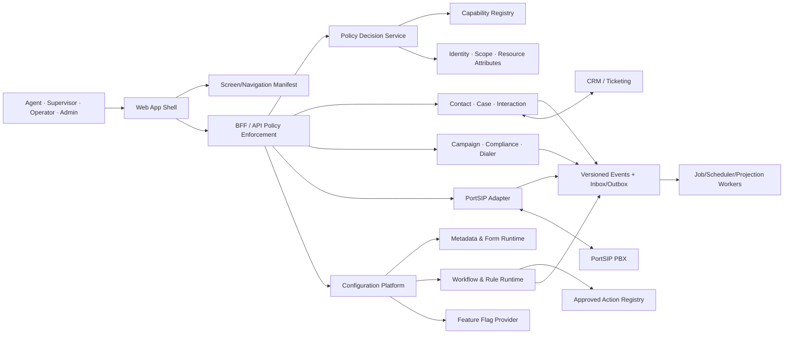

# Kiến trúc mở rộng, phân quyền và cấu hình động

## 1. Kết luận kiến trúc

Portsip CC nên mở rộng theo **contract và metadata**, không theo cách cho phép upload/chạy mã tùy ý trong production. P0 bổ sung một extensibility kernel dùng chung cho inbound, outbound, CRM và Admin:

- module boundaries + ports/adapters + versioned command/query/event contracts;
- Capability Registry và Policy Service cho phân quyền dữ liệu, tính năng, màn hình, field và action;
- Configuration Registry có phân lớp, effective-value view, version, approval và audit;
- Metadata/Form Runtime cho custom fields, form sections và conditional visibility;
- Business Workflow/Rule Runtime khai báo bằng metadata, chỉ gọi action đã đăng ký;
- Admin Center/Config Studio để operator cấu hình, validate, preview, simulate, publish và rollback.

Các finite-state machine bảo vệ an toàn thoại (`registration`, `call/session`, `dial_attempt`), tenant isolation, DNC/consent, secret handling và giới hạn carrier vẫn là **code-owned invariants**. Operator không được sửa các guard này bằng workflow động.

P0 không phải một low-code platform tổng quát: không arbitrary JavaScript/SQL, không upload plugin runtime, không tự sửa event schema, không BPMN đầy đủ và không drag-drop UI tùy ý. Những khả năng đó chỉ đánh giá ở P1/P2 sau security/performance/governance gate.

## 2. Kiến trúc logic mục tiêu



Các thành phần trên là logical modules. MVP có thể giữ trong modular monolith và cùng một deployment artifact; chỉ tách service khi có bằng chứng về tải, blast radius, security boundary hoặc team ownership.

## 3. Quy tắc module và extension points

### 3.1 Ranh giới bắt buộc

1. Mỗi module sở hữu schema/tables và migration của mình; module khác không đọc/ghi trực tiếp table nội bộ.
2. Không import package nội bộ hoặc dùng chung ORM entity/repository của module khác. Giao tiếp đồng bộ qua typed public application ports (`command/query`) và bất đồng bộ qua versioned domain events.
3. Transaction không đi xuyên module; dùng local transaction + outbox, idempotency và saga/compensating action khi cần.
4. PortSIP/CRM/IdP/carrier nằm sau adapters; domain không import SDK/vendor DTO trực tiếp.
5. Shared kernel chỉ chứa primitives ổn định như IDs, time, money/phone value objects, event envelope và authorization context; không chứa business logic của module.
6. Cross-module search/report chỉ đọc projection/read model; không join thẳng table nội bộ xuyên module.
7. Mọi module mới phải đăng ký capability, config definitions, events, health checks, metrics, migrations và ownership/runbook qua module manifest.
8. CI có architecture tests cho dependency direction, forbidden imports/table access và public-contract coverage.
9. Không tạo một `common/service/utils` vô hạn hoặc một rules table dùng chung cho mọi domain.

Các outbound port ổn định tối thiểu gồm `TelephonyGateway`, `CrmConnector`, `IdentityProvider`, `RecordingRepository`, `EventPublisher`, `JobScheduler`, `NotificationProvider` và `Clock`. Domain chỉ biết các port này; adapter vendor chịu mapping, auth, retry, rate limit và contract-version compatibility.

### 3.2 Extension registry

| Extension point | Contract ổn định | Built-in P0 | Cách bổ sung an toàn |
|---|---|---|---|
| CRM adapter | Contact/case lookup, upsert, outcome sync | Một connector | Implement adapter + contract/conformance tests |
| Dial mode | Reserve, dispatch, cancel, reconcile | Manual, preview, progressive 1:1 | Strategy được compile/deploy; capability + feature flag riêng |
| Eligibility rule | Input facts → allow/deny/reason | DNC, consent, timezone, retry | Thêm declarative rule/action từ approved registry |
| Assignment/routing | Candidate set → selected target + reason | Team/skill/priority | Strategy versioned; deterministic simulation |
| Workflow action | Typed input/output, timeout, retry policy | Assign, notify, update field, create task, call approved connector | Chỉ action đã đăng ký; không arbitrary script/URL |
| Import mapper | Source row → canonical record/errors | CSV + một CRM schema | Versioned mapping template + dry-run |
| Notification | Event → channel/template/delivery result | In-app/email nếu chọn | Adapter + template policy + rate limit |
| Report projection | Versioned events → read model | Inbound/outbound core KPIs | Projection riêng, rebuild/backfill contract |
| UI extension slot | Manifest → approved component/view | Contact panel, script, timeline | Compile-time component registry; không tải remote code |

Mỗi extension manifest có `extension_key`, semantic/contract version, config-schema version, compatibility range, capability/event dependencies, health check, owner, feature flag và kill switch. P0 chỉ chạy trusted compiled modules đã review và deploy qua CI; Admin UI chỉ chọn/cấu hình extension đã đăng ký.

### 3.3 Khi nào mới tách microservice

Chỉ tách module khi ít nhất một điều kiện có evidence:

- cần scale độc lập hoặc workload khác biệt rõ;
- cần isolation vì secret/privileged PortSIP access;
- cần release cadence/ownership độc lập;
- sự cố module gây blast radius không chấp nhận được;
- data residency/retention yêu cầu deployment boundary riêng.

Tách service không thay đổi public contract. Consumer-driven contract tests và migration/backfill plan là exit criteria.

## 4. Mô hình phân quyền thống nhất

### 4.1 Một access decision

Mọi quyết định có dạng:

```text
can(subject, capability, resource, action_context) -> allow | deny + reason_code
```

- `subject`: user/service, role templates, direct grants, teams, attributes, authentication strength.
- `capability`: hành động ổn định như `interaction.note.edit`, `campaign.publish`, `recording.play`, `trunk.change.apply`.
- `resource`: tenant, business unit, team, queue, campaign, contact/case/interaction, recording, config change.
- `action_context`: resource state, ownership/assignment, channel, environment, time, approval relation, data classification.

P0 dùng **RBAC + scoped grants + relationship/attribute conditions**. Không mã hóa logic kiểu `if role == Admin` rải rác trong controller/UI. Deny-by-default; explicit deny và invariant bảo mật thắng allow.

```text
ALLOW = entitlement_or_feature_available
        AND capability_granted
        AND resource_relationship_or_scope_matched
        AND attribute_conditions_passed
        AND no_hard_or_explicit_deny
```

Thiếu tenant/context, capability lạ, quan hệ không phân giải được hoặc policy lỗi đều `DENY`. Thứ tự ưu tiên là hard security/compliance deny → explicit deny → explicit allow → default deny. Feature flag chỉ làm code path có mặt, tuyệt đối không cấp quyền.

### 4.2 Bốn lớp quyền

| Lớp | Câu hỏi | Ví dụ | Enforcement bắt buộc |
|---|---|---|---|
| Data scope | Được thấy record nào? | Tenant, business unit, team, queue, campaign, assigned/own/all | Query filter, object lookup, realtime subscription, search/export |
| Quyền tính năng/capability | Được thực hiện nghiệp vụ gì? | View/edit/publish/approve/export/listen/barge/apply config | API/BFF và background command handler |
| Screen/navigation | Được mở màn hình/menu nào? | Campaign, Recordings, Telephony Settings | UI manifest để UX; route/API vẫn kiểm tra capability |
| Field/action | Field nào view/mask/edit; action nào hiện/được chạy? | Phone full/masked, note edit, recording download | Response shaping + write validation + export/print |

### 4.3 Organization tree và resource relationship graph

Không ép mọi scope vào một cây giả. P0 dùng hai cấu trúc riêng:

```text
Organization: Tenant → Business Unit → Team
Subject:      User/Service ─member_of→ Team/Business Unit

Resources: Queue ─assigned_to→ BU/Team
           Campaign ─owned_by/operated_by→ BU/Team
           Contact/Case/Interaction ─owner/assigned_to/participant→ User/Team/Queue/Campaign
```

User/service là subject có membership hiệu lực thời gian và có thể thuộc nhiều team/BU; không phải node sở hữu cứng trong cây. Queue/campaign cũng có thể gắn nhiều team theo relationship. `own`, `assigned` và `participant` là predicate trên quan hệ, không phải node con. Một role binding gồm `subject + role/capability_set + scope_type + scope_id + include_descendants + conditions + valid_from/to`. Rule multi-membership, conflict/deny precedence và orphaned-resource phải được chốt ở D-017. Client không được tự gửi `app_tenant_id`, role hoặc scope rồi yêu cầu server tin tưởng; tenant context lấy từ authenticated session/token mapping.

### 4.4 Policy architecture

- **PAP — Policy Administration**: UI quản lý role templates, scoped grants, field masks, approval/separation-of-duties và access review.
- **PDP — Policy Decision**: một contract tập trung trả allow/deny, `reason_code`, `policy_version`, matched scope và obligations như `hide`, `mask:phone_last4`, `read_only`, `require_step_up` hoặc `require_approval`.
- **PIP — Policy Information**: identity/group từ IdP, resource relations từ app DB, state/classification từ domain modules, environment/auth strength.
- **PEP — Policy Enforcement**: middleware/API, query repository, object lookup, WebSocket/SSE subscription, exports, files/recordings, workers và admin commands.

Policy cache bắt buộc có tenant/subject/policy-version key, TTL ngắn và invalidation event khi role, membership, relationship hay classification đổi. Realtime subscription phải bị re-evaluate/revoke trong SLO đã duyệt. Khi PDP/PIP không sẵn sàng, thao tác nhạy cảm fail closed; call controls thiết yếu dùng một emergency/degraded policy đã threat-model, không dùng cached allow vô thời hạn.

### 4.5 Role templates và segregation of duties

Role chỉ là template capability, không đồng nghĩa data scope:

- `Agent`: own/assigned interactions, contacts cần cho phiên làm việc, không export/listen recording mặc định.
- `Supervisor`: team/queue scope; monitor/whisper/barge và reports theo grant.
- `Campaign Manager`: campaign scope; list/script/policy/publish nhưng không sửa regulatory DNC master ngoài grant.
- `Compliance Admin`: DNC/consent/retention/audit; không tự duyệt config do chính mình tạo nếu maker-checker bật.
- `Telephony Config Editor`, `Approver`, `Executor`: tách draft, approve và production apply.
- `Platform Admin`: role/config/schema/workflow administration; không mặc định được xem unmasked PII/recording.

Break-glass cần step-up authentication, reason/ticket, time-boxed grant, alert tức thời và hậu kiểm. Không có shared admin account.

### 4.6 Data và field controls

- Data classification tối thiểu: `Public`, `Internal`, `Confidential`, `Restricted`.
- Field policy actions: `view`, `view_masked`, `edit`, `search`, `export`, `print`, `download`, `listen`.
- Search result/count, autocomplete, dashboard aggregate và export phải dùng cùng scope policy; không rò rỉ record qua count hoặc filter option.
- WebSocket/SSE topic được server bind từ effective scope; không subscribe bằng arbitrary queue/campaign ID.
- Recording playback dùng short-lived authorized URL/proxy; `play` và `download` là capability khác nhau.
- Export có capability/row cap/reason/approval riêng; policy được đánh giá lại lúc tạo job, lúc chạy và lúc tải. File được mã hóa, URL ngắn hạn, watermark/actor và audit; field tiếp tục omit/mask theo policy.
- Background jobs chạy bằng service identity + delegated tenant/scope và lưu originating actor/approval reference, không chạy ngầm như super-admin.
- PEP phải chặn ở query builder trước khi đọc dữ liệu; không query rộng rồi lọc trong memory. PortSIP Adapter re-authorize ngay trước mọi privileged command.

## 5. Configuration Registry và effective settings

### 5.1 Config definition

Mỗi setting là một typed definition, tối thiểu có:

| Metadata | Ý nghĩa |
|---|---|
| `key`, `version`, `owner_module` | Định danh ổn định và owner |
| `value_type`, `default`, `enum/options` | Boolean, number, duration, string, object/reference |
| `validation_schema` | Range, pattern, cross-field/dependency validation |
| `allowed_scopes`, `precedence` | Environment/tenant/business-unit/team/queue/campaign/user |
| `read_capability`, `write_capability`, `approve_capability` | Quyền riêng cho view/edit/apply |
| `classification`, `secret` | Masking và vault-reference behavior |
| `risk_level`, `approval_policy` | Standard, sensitive, production-critical |
| `activation_mode` | Immediate, scheduled, new-instance-only, restart-required |
| `ui_control`, `help`, `example` | Form control, plain-language guidance và safe default |
| `impact_tags`, `dependencies` | Call routing, compliance, reporting, migration, cache invalidation |

Frontend render từ registry nhưng backend vẫn validate theo schema và domain invariant. Registry không cho operator tạo key tùy ý; module owner đăng ký key qua code/migration.

### 5.2 Phân lớp và precedence

Mỗi key khai báo rõ scope được override và precedence; không có một precedence ngầm cho mọi domain. Baseline đề xuất:

```text
platform default < environment < tenant < domain resource (BU/team/queue/campaign) < user
```

User override chỉ tồn tại cho setting được allow, ví dụ audio/UI preference; không override compliance, retention, caller ID hoặc security policy. Nếu một request đồng thời thuộc team + queue + campaign, config definition phải khai báo evaluator/priority cụ thể. Ambiguous match là validation error, không chọn ngẫu nhiên.

UI luôn hiển thị:

- effective value;
- nguồn kế thừa và toàn bộ resolution chain;
- override hiện tại;
- ai/thời điểm/version thay đổi;
- tác động và cần restart/new-instance-only hay không;
- nút `Reset to inherited` thay vì copy lại default.

### 5.3 Config lifecycle

```text
draft → validated → simulated/previewed → pending_approval → scheduled/published → effective
                                                                    ↘ failed/drifted
effective → superseded/rolled_back
```

Publish tạo immutable version. Rollback là publish lại một version tương thích, không sửa audit history. Setting secret chỉ lưu vault secret-version reference. Change conflict dùng optimistic concurrency/ETag; operator phải refresh/rebase nếu base version đã thay đổi.

Feature flag tách khỏi permission: flag quyết định code path có khả dụng, permission quyết định subject có được dùng. Tắt flag không cấp quyền và bật flag không vượt policy.

## 6. Custom fields và form/layout động

### 6.1 P0 entity scope

Cho phép cấu hình custom fields trên `contact read-model`, `case`, `interaction`, `campaign_member` và `disposition form`. Không cho thêm dynamic field trực tiếp vào PortSIP-owned CDR/trunk/session schema.

Field types P0: text, long text, integer/decimal, boolean, date/datetime, single-select, multi-select, phone, email, URL và reference tới approved user/team/queue/campaign. File/formula/rich text chỉ P1 sau security/performance review.

### 6.2 Field definition

Mỗi field có stable key, label/help text/i18n key, entity binding, type, default, required/read-only, validation, option/reference source, classification, encryption/retention, search/filter/sort/index/export flags, view/edit/unmask capabilities, effective dates và lifecycle state. Field mới mặc định ở classification hạn chế; hạ classification hoặc bật export/index cần quyền và approval riêng.

Không cho đổi type phá dữ liệu tại chỗ. Thay đổi breaking tạo field/schema version mới + migration/backfill plan. Xóa là deprecate/hide trước; purge theo retention/approval riêng.

### 6.3 Form/layout definition

- Form gồm page/tab/section/group, ordered fields, column span và approved UI components.
- Conditional visibility/required/read-only dựa trên declarative expression với allowlisted facts; backend đánh giá lại khi submit.
- Form có bindings theo persona, queue, campaign, case type và workflow state.
- Screen layout chỉ cho approved slots; không arbitrary HTML/CSS/component URL.
- Draft có preview bằng sample/synthetic data, accessibility check, permission simulation và responsive viewport.
- Frontend và backend dùng cùng versioned schema/validation artifact; backend luôn authoritative và từ chối payload cố bypass conditional-required/read-only rules.

### 6.4 Storage và query

- Definition/version nằm trong metadata tables; record giữ `schema_version` và `custom_values` JSONB/document column.
- Backend validate custom values theo published schema. Các field được search/report phải tạo typed index/projection; không query JSON tùy ý ở báo cáo nóng.
- Không dùng EAV thuần cho toàn bộ domain vì khó type-check, index, migrate và bảo toàn integrity.
- API trả field manifest đã lọc theo permission; giá trị Restricted được omit/mask tại server trước khi tới browser.

## 7. Business Workflow và Rule Runtime

### 7.1 Ranh giới cấu hình động

Workflow động dành cho quy trình nghiệp vụ: case lifecycle, disposition follow-up, approval, assignment, SLA/escalation, campaign review và config change. Telephony/call/dial-attempt state machines, compliance hard-stop và security invariants vẫn ở code.

### 7.2 Workflow definition

Một published workflow version gồm:

- states: initial/terminal, label/color/SLA semantics;
- transitions: from/to, required capability và allowed resource state;
- guards: typed declarative conditions;
- form binding và required fields theo transition;
- actions từ Approved Action Registry;
- timer/SLA, escalation và notification;
- approval quorum, maker-checker và delegation rules;
- retry/timeout/idempotency/compensation policy;
- effective-from, owner, change reason và compatibility metadata.

Expression language chỉ truy cập allowlisted facts/functions, có CPU/time/size limits và deterministic evaluation. Không `eval`, JavaScript, SQL, shell hoặc arbitrary outbound URL.

Validator trước publish phát hiện dependency cycle, unreachable/terminal state thiếu đường vào, action loop, incompatible schema/capability và timer không có owner/escalation. Simulator phải giải thích guard/rule/action nào khớp, input version và lý do allow/deny.

### 7.3 Versioning và execution

- Instance mới pin published workflow version tại thời điểm tạo.
- Instance đang chạy tiếp tục version cũ theo mặc định; migration sang version mới là explicit mapping + dry-run + approval.
- Timer/jobs có durable storage với `app_tenant_id`, `handler_key/version`, `run_at`, `payload_schema_version`, `status`, `lease_until`, `attempt/max_attempts`, `idempotency_key`, optional `initiating_subject_id`, `executing_service_id`, capability/action key, pinned policy/workflow/config version, approval reference và correlation/causation IDs; deploy/restart không làm mất timer.
- Hỗ trợ `wait_until`, `wait_for_event`, `wait_for_callback` và SLA/escalation theo business calendar, tenant timezone/DST, pause/resume clock và outage catch-up policy.
- Mỗi guard/action ghi input hash, outcome, policy/workflow version, actor/service identity và correlation ID.
- Action timeout/unknown result không tự chạy lại nếu không idempotent; chuyển `reconcile_pending` hoặc manual task.

### 7.4 Logic packs chờ mở rộng

P0 tạo contract/registry và ít nhất một built-in cho mỗi nhóm:

| Logic pack | Built-in ban đầu | Bổ sung sau |
|---|---|---|
| Validation | Required, regex/range, cross-field | External verification adapter |
| Eligibility | DNC/consent/timezone | Market-specific policy packs |
| Assignment | Owner/team/round-robin/priority | Capacity/skill/score strategies |
| Retry | Outcome → cooldown/max attempts | Data-driven optimization |
| Escalation | SLA threshold → notify/reassign | Multi-level/on-call policies |
| Approval | Single + maker-checker | Quorum/sequential/conditional |
| Enrichment | CRM lookup/mapping | Additional approved connectors |
| Notification | In-app/template | Email/SMS/Chat adapters |
| Post-call | Disposition → task/outcome sync | QA/AI actions sau gate |

Logic pack là versioned metadata hoặc compiled adapter theo contract; không phải package code do operator upload.

## 8. Admin Center và Operator UX

### 8.1 Information architecture

Đề xuất menu role-aware:

1. **Overview & Health** — integration/config drift, failed jobs, pending approvals, recent changes.
2. **People & Access** — users, role templates, scoped grants, access review, break-glass history.
3. **Teams, Queues & Skills** — mapping/read-only PortSIP state và app-owned scope relationships.
4. **Channels & Routing** — trunk/DID/rules theo boundary của tài liệu 07.
5. **Outbound** — campaign templates, caller-ID profiles, retry/pacing/compliance policies.
6. **Data & Forms** — custom fields, option sets, forms/layouts, import mappings.
7. **Workflows & Automation** — states, transitions, rules, timers, actions và execution history.
8. **Integrations** — CRM/IdP/notification adapters, secret status/rotation và test connection.
9. **Reporting & Compliance** — KPI definitions, retention, DNC/consent, exports.
10. **Feature & Application Settings** — effective settings, flags và UI preferences.
11. **Change Requests & Audit** — drafts, approvals, publish/rollback và immutable history.

Menu bị ẩn theo capability để dễ dùng, nhưng đây không phải enforcement. Deep link, API và object access vẫn phải qua PEP/PDP.

### 8.2 Mẫu thao tác thống nhất

Mọi cấu hình có tác động vận hành dùng một mental model:

```text
Choose template → Edit draft → Validate → Preview effective value/diff
→ Simulate/Test → Submit approval → Schedule/Publish → Monitor → Supersede/Roll back
```

UX requirements:

- Basic mode trước, Advanced mode có warning/permission riêng; progressive disclosure thay vì form dài.
- Plain-language label + ví dụ + recommended default; thuật ngữ PortSIP nằm trong tooltip/advanced detail.
- Dependency/impact panel cho biết queue/campaign/field/workflow nào bị ảnh hưởng.
- Search/filter/sort, saved views, bulk action có dry-run và downloadable error report.
- Inline validation + summary; không xóa input khi lỗi; autosave draft và cảnh báo concurrent edit.
- Trường bị khóa/ẩn phải có giải thích “vì sao” và owner để xin quyền; history hỗ trợ compare, clone version và rollback có điều kiện.
- Preview theo role/scope/persona; “View as Agent/Supervisor” không cấp thêm quyền.
- Empty, loading, permission-denied, degraded, drift, partial-failure và no-data states có hướng xử lý rõ.
- Undo chỉ cho local draft; published change dùng new version/rollback workflow, không hứa atomic undo.
- WCAG 2.1 AA, keyboard navigation, focus/error summary, không chỉ dùng màu để biểu thị state.

### 8.3 Setting exposure matrix

| Cấp | Đưa lên frontend | Guardrail |
|---|---|---|
| Operator-safe | SLA thresholds, reasons/dispositions, scripts, campaign templates, business hours/holidays, alerts, form labels/layout, option sets | Typed controls, safe range, preview, audit |
| Scoped admin | Role/grant scope, custom fields, workflow transitions/timers, import mappings, caller-ID profiles, tenant trunk/rules, retention policy | Capability + impact analysis + approval/test/version |
| Advanced | Connector credentials/rotation, field classification/masking, feature rollout, bulk migration/backfill | Step-up, maker-checker, dry-run/canary, rollback plan |
| System-only / không expose P0 | PBX global transports/ports, SBC/firewall/cert private keys, encryption master keys, raw PortSIP bearer, raw SQL/JSON event edit, arbitrary code/URL, system/shared/IP-based trunk write | IaC/vendor portal/privileged operations, separate audit and runbook |

Nguyên tắc: nếu một setting có thể được biểu diễn bằng typed schema, validate an toàn, phân quyền, preview/test và rollback/version thì ưu tiên đưa lên frontend. Nếu không đáp ứng đủ các điều kiện đó, chỉ hiển thị read-only health/effective state + deep-link/runbook.

Config sandbox phải tách Prod, chỉ dùng synthetic/anonymized data và connector stub. Sandbox không được nhận credential Prod, dial/send thật hoặc ghi dữ liệu Prod. Promotion sang production luôn tạo version/change request mới, re-validate dependency và re-authorize approver/executor.

## 9. Contract, event và compatibility

- Public/internal APIs dùng explicit version và schema; thay đổi additive là mặc định, breaking change cần version mới + deprecation window.
- Canonical event envelope tối thiểu: `event_id`, `event_type`, `event_version`, `occurred_at`, `producer`, `app_tenant_id`, `aggregate_type/id/version`, optional `initiating_subject_id`, optional `executing_service_id`, `correlation_id`, `causation_id`, `trace_id`, `data`; chi tiết ở tài liệu 11.
- Consumer phải ignore unknown additive fields và hỗ trợ `N`/`N-1` trong rolling upgrade; unknown/breaking version vào quarantine/DLQ thay vì xử lý đoán. Schema fixtures, compatibility/upcaster và consumer contract tests chạy trong CI.
- Events/metadata/workflows/config versions là immutable. Backfill/replay có namespace/run ID và không phát side effect hai lần.
- Capability/config/field/workflow keys không tái sử dụng sau deprecation.
- Adapter mapping giữ raw vendor payload/reference riêng, canonical domain event không rò vendor DTO.
- Feature rollout dùng provider-neutral evaluation API/adapter; default rõ và fail behavior theo risk của flag.
- Database thay đổi theo `expand → migrate/backfill → contract`; rolling deploy phải chạy được với schema cũ và mới. Mỗi module sở hữu migration; rollback mặc định là forward fix hoặc version re-publish, không giả định down migration an toàn.

## 10. NFR, observability và test bắt buộc

Telemetry phải trả lời được “version nào quyết định và vì sao” mà không làm lộ secret/PII:

- policy decision/deny reason, policy version, cache/invalidation lag và realtime revoke lag;
- config revision, effective-source, propagation/drift; feature-flag evaluation error và stale flag;
- workflow/rule/action version, stuck instance, timer lag, lease expiry, retry/DLQ và reconcile backlog;
- adapter/extension health, contract mismatch, migration/backfill state và dependency failure;
- correlation/causation/trace ID xuyên BFF → domain → worker → PortSIP/CRM.

Không dùng tenant/user/resource IDs làm metric labels cardinality cao; giữ trong masked structured log/trace theo retention policy. Test suite tối thiểu gồm:

- architecture dependency/forbidden-import tests và adapter conformance;
- API/event/schema `N`/`N-1` compatibility và expand/migrate rolling-deploy test;
- permission matrix cho tenant/BU/team/queue/campaign/own trên API, object lookup, WebSocket, search/count/facet, report, export, file và worker;
- field masking/write/export leakage, role/membership revoke, SoD và break-glass tests;
- config effective-value/dependency/rollback, schema publish/backfill/legacy render;
- workflow deterministic simulation/replay, timer survive restart/failover/DST, in-flight old-version và non-idempotent unknown result;
- frontend navigation/route/action manifest snapshot và representative operator usability test.

## 11. Phạm vi phát hành và tác động kế hoạch

### P0 — extensibility kernel và bounded self-service

- module contracts, ports/adapters, inbox/outbox và versioned events;
- capability registry, scoped RBAC + relationship/attribute conditions, data/query/realtime/export/field enforcement;
- config registry, effective-value resolver, feature flag adapter, draft/version/approval/audit;
- custom fields + form/layout editor có giới hạn cho các entity P0;
- business workflow runtime + guided state/transition/timer/action editor, không arbitrary code;
- Admin Center role-aware với validate/preview/simulate/test/publish/rollback;
- built-in logic packs và extension registries nêu trên.

### P1

- visual workflow canvas, reusable subflows, advanced policy condition builder;
- formula/file/rich-text custom fields sau security/performance gate;
- delegated administration nhiều cấp, scheduled access review/certification;
- UI dashboard/layout builder nâng cao và nhiều connectors/actions.

### P2

- third-party plugin SDK/marketplace hoặc runtime sandbox nếu có business case;
- BPMN/DMN đầy đủ, external rule authoring và multi-tenant white-label platform;
- predictive/AI-driven logic chỉ sau data/compliance gates.

Scope P0 này lớn hơn baseline `24–26 tuần` trước vòng mở rộng. ROM sơ bộ đã được nâng và cần khóa ở D-019:

- `28–32 tuần ±30%` với 7 core FTE + specialist part-time;
- `26–29 tuần ±30%` nếu bổ sung 1 Platform/Backend, 1 Frontend/Admin UX và 0,5 QA/Security Automation so với baseline; specialist outbound/telephony vẫn phải giữ theo staffing plan;
- giữ `24–26 tuần` chỉ khi P0 có kernel + role/config templates, còn self-service form/workflow editor chuyển P1.

Full low-code/BPMN/runtime plugin không nằm trong các ROM trên.

## 12. Acceptance criteria kiến trúc

### Extension

- Thêm CRM adapter hoặc notification adapter mới không sửa domain model/call FSM; conformance tests chạy xanh.
- Thêm một approved workflow action/assignment strategy qua registry không sửa workflow runtime.
- Event consumer cũ vẫn xử lý event có additive field; breaking schema bị CI chặn nếu chưa version/deprecation.
- Worker retry/replay không tạo duplicate side effect; DLQ/reconcile/backfill có correlation/audit.

### Authorization

- 100% API/query/object lookup/realtime/export/file/worker entry points có PEP; missing policy deny mặc định.
- Người biết/đoán resource ID ngoài scope vẫn nhận deny và không rò field/count/status.
- Ẩn menu không thay enforcement: gọi trực tiếp API/deep link vẫn bị deny.
- Field Restricted bị omit/mask nhất quán ở detail/list/search/export/realtime; write vào field read-only bị server reject.
- Export re-evaluate scope/field policy tại request, execution và download; revoke trước download chặn file dù job đã hoàn tất.
- Maker không approve/publish change của chính mình khi segregation policy bật; break-glass hết hạn tự động và có alert/audit.
- Policy change invalidates cache trong proposed window được chốt ở PoC; stale allow không kéo dài ngoài bound.

### Dynamic config/form/workflow

- Operator thêm custom field, gắn vào form theo queue/campaign, đặt conditional required, preview theo role và publish mà không deploy code.
- Record cũ/new hợp lệ theo pinned schema version; breaking type change cần migration dry-run.
- Effective setting hiển thị đúng resolution chain và `Reset to inherited`; ambiguous precedence bị chặn.
- Workflow instance đang chạy giữ version cũ; migration mới chỉ chạy sau mapping/dry-run/approval.
- Timer sống qua restart; non-idempotent action có unknown result chuyển reconcile/manual thay vì chạy lặp.
- Không thể nhập/chạy JavaScript, SQL, shell, arbitrary URL hoặc remote UI component qua Config Studio.
- Sandbox không thể gọi real trunk/dial/send, dùng credential Prod hoặc ghi Prod; promotion luôn qua approval/version mới.
- Workflow/setting tùy biến không thể bỏ qua tenant isolation, authorization, DNC/consent, call/session/dial-attempt integrity hoặc carrier hard guardrail.

### Operator UX

- Representative operators hoàn thành các kịch bản role grant, field/form publish, workflow publish và setting rollback trong usability test mà không cần truy cập DB/CLI.
- Mọi config screen có owner/help/effective value/impact/version/audit; sensitive screen có step-up/approval phù hợp.
- Error, drift và partial failure chỉ ra object bị ảnh hưởng, safe next action và correlation ID hỗ trợ vận hành.

## 13. Quyết định cần khóa

1. Organization tree, queue/campaign resource relationships và rule khi một user/resource thuộc nhiều scope.
2. Capability catalog, default role templates và field classification/masking matrix.
3. PDP implementation: app-owned contract trước; chọn thư viện/external engine sau benchmark/operability PoC.
4. Entity nào được custom fields/forms ở P0 và số lượng/index/report constraints.
5. Workflow/action/timer nào bắt buộc P0; ranh giới code-owned invariant và configurable business rule.
6. Setting precedence, approval/risk levels và danh sách system-only.
7. Self-service builder có bắt buộc go-live hay template-driven configuration là phương án Adjust chấp nhận được.
8. Policy/config/schema/workflow cache invalidation SLO và rollback/deprecation windows.
9. ROM/team: chọn 28–32 tuần, tăng tốc 26–29 tuần hay dời builder để giữ 24–26 tuần.
10. D-023 reference stack/toolchain, exact versions và Build Profile; handbook dùng TypeScript/React/NestJS/PostgreSQL làm hypothesis cho tới khi decision được Approved.

## 14. Liên kết tài liệu

- [Kế hoạch tổng thể](01-KE-HOACH-TRIEN-KHAI.md)
- [Feature catalog](02-DANH-MUC-TINH-NANG.md)
- [Kiến trúc PortSIP](03-KIEN-TRUC-TICH-HOP.md)
- [Discovery/PoC](04-DISCOVERY-POC.md)
- [Nguồn tham khảo](05-NGUON-THAM-KHAO.md)
- [Decision register](06-DECISION-REGISTER.md)
- [Outbound và SIP Trunk Admin UI](07-OUTBOUND-VA-SIPTRUNK-ADMIN.md)
